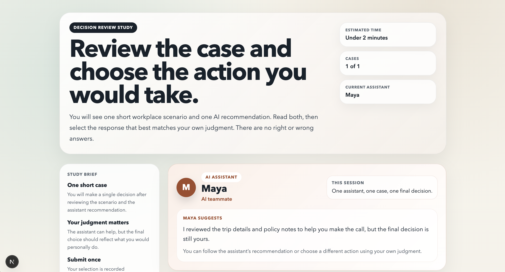
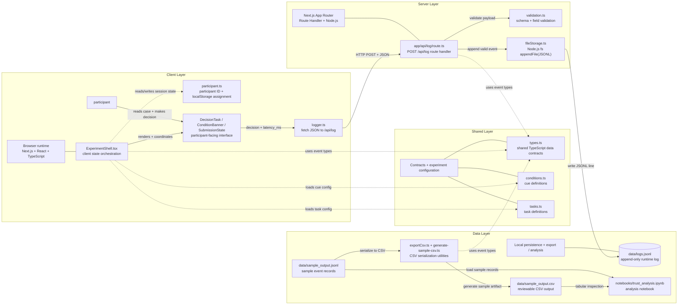

# HumanAI Trust Experiment Prototype

## Overview

This repo is a MVP for a human-AI trust experiment. The scope is intentionally minimal, but the internal structure is modular so it can grow into the broader experimentation engine described in the full HumanAI project brief.

I designed with the goal to keep the app small while making the core experiment pieces easy to replace, extend, and analyze.

## Home Page



## System Design

The first step in approaching this project was to develop a comprehensive system design to ensure each deliverable will be met and so I can start developing with a long-term vision in mind.



## Condition Logic

The experiment has two conditions that differ only in how the assistant is presented.

- Condition A uses a more system-like assistant label and a neutral, formal tone
- Condition B uses a more humanlike assistant name and a warmer, conversational tone
- the actual reccomendation content itself stays the same

## Logging Implementation

The client measures task-response latency with `performance.now()`, then submits a single decision event to `/api/log` as JSON.

On the server:

- `app/api/log/route.ts` receives the request
- `lib/validation.ts` validates the event schema
- `lib/fileStorage.ts` appends one JSON object per line to `data/logs.jsonl`

The logged schema includes `participant_id`, `condition`, `decision`, `timestamp`, and `latency_ms`, plus a few extra flat fields such as assistant name and task title.

## How to Run Locally

```bash
npm install
npm run dev
```

Open (condition A): [http://localhost:3000](http://localhost:3000).
Open (condition B): [http://localhost:3000/?condition=B](http://localhost:3000/?condition=B).

## Sample Output

The repository includes sample outputs in the same formats a reviewer would care about:

- `data/sample_output.jsonl`: sample of the runtime logs
- `data/sample_output.csv`: CSV export of the same records

`data/logs.jsonl` kept empty and is what is updated at runtime

## Design Decisions

This prototype was designed to fulfill the screening requirements while remaining easily extensible.

My implementation choices (listed below) are the result of balancing those two constraints.

### Config-driven cue manipulation

The full project emphasizes manipulation of a variety of cues while the screening only needed a simple A/B difference. So, I defined conditions declaratively in `lib/conditions.ts`

Reasoning:

- additional cue dimensions can be added later without rewriting the UI

### Easily extendable task list

The screening version only includes one task, but the task still lives in my `lib/tasks.ts` and is rendered from a typed config.

Reasoning:

- makes it straightforward to add more tasks or task variants later

### API boundary in front of local storage

The test only stated local logging, so this version uses append-only JSONL instead of a database. Even so, I decided to use `/api/log`, validation helpers, and file-storage helpers.

Reasoning:

- makes it easy to swap the storage layer later (for an eventual database)

